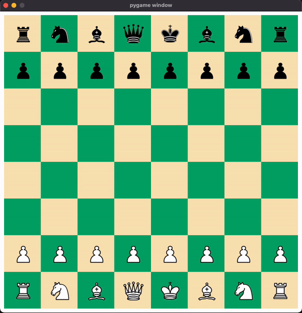

# Chess AI with Minimax Algorithm




This project implements a chess game AI powered by the Minimax algorithm with alpha-beta pruning. The AI is designed to play competitive chess moves, simulating intelligent gameplay based on a score-evaluation system. The project can serve as a base for further AI development in chess or other board games.

## Table of Contents
- [Chess AI with Minimax Algorithm](#chess-ai-with-minimax-algorithm)
  - [Table of Contents](#table-of-contents)
  - [Project Overview](#project-overview)
  - [Features](#features)
  - [Installation](#installation)
  - [Usage](#usage)
  - [AI Algorithm Details](#ai-algorithm-details)
    - [Minimax with Alpha-Beta Pruning](#minimax-with-alpha-beta-pruning)
    - [Evaluation Function](#evaluation-function)
    - [Key Parameters](#key-parameters)
  - [Contributing](#contributing)

## Project Overview
This chess game AI uses the Minimax algorithm to evaluate possible moves and make decisions. The AI simulates potential moves by both players up to a certain depth, evaluating the board's score at each move to determine the best strategy. Alpha-beta pruning is used to optimize the search process, enhancing performance.

## Features
- **Chess Gameplay**: Play chess against an AI opponent.
- **AI-Powered Moves**: The AI uses the Minimax algorithm with alpha-beta pruning for efficient, smart move generation.
- **Score Evaluation**: The board's score is calculated based on piece values and positions, taking into account possible threats and defenses.
- **Check and Checkmate Detection**: Ensures accurate endgame handling.

## Installation

1. Clone the repository:
   ```bash
   git clone https://github.com/your-username/chess-minimax-ai.git
   cd chess-minimax-ai
   ```
   
2. Install dependencies
   ```bash
   pip install -r requirements.txt
   ```

3. Run the game
  ```bash
  python game.py --depth depth (--threat) (--defense)
  ```

## Usage
Once the game is running, you can interact with the chessboard and play against the AI. Configure the AI’s search depth to adjust difficulty, and use the visualization tool to view moves and evaluate the AI's decision-making.

## AI Algorithm Details

### Minimax with Alpha-Beta Pruning

The Minimax algorithm explores possible moves up to a certain depth, assigning scores based on board evaluations. Alpha-beta pruning optimizes this process by "pruning" branches that are unlikely to affect the final decision, making the algorithm faster without sacrificing decision quality.

### Evaluation Function

The evaluation function calculates the board's score by summing up piece values, considering threats and defenses. Each move generates a new board state, which is evaluated to decide on the best possible move. The threat mode takes into account the pieces targeted by the actual player. The defense mode takes into account the piece targeted by the other player.

### Key Parameters

  1. Depth: Defines how many moves ahead the AI calculates. Higher depth increases difficulty but requires more computation.
  2. Alpha-Beta Pruning: Reduces the number of nodes the algorithm evaluates, optimizing processing time.

## Contributing

Contributions to improve the AI, add features, or optimize code are welcome! Please submit a pull request or create an issue to discuss your ideas.
